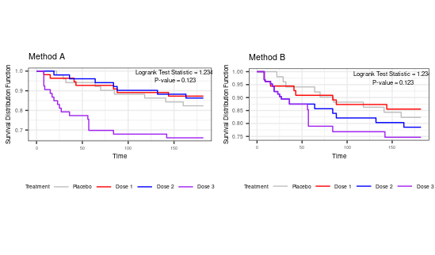
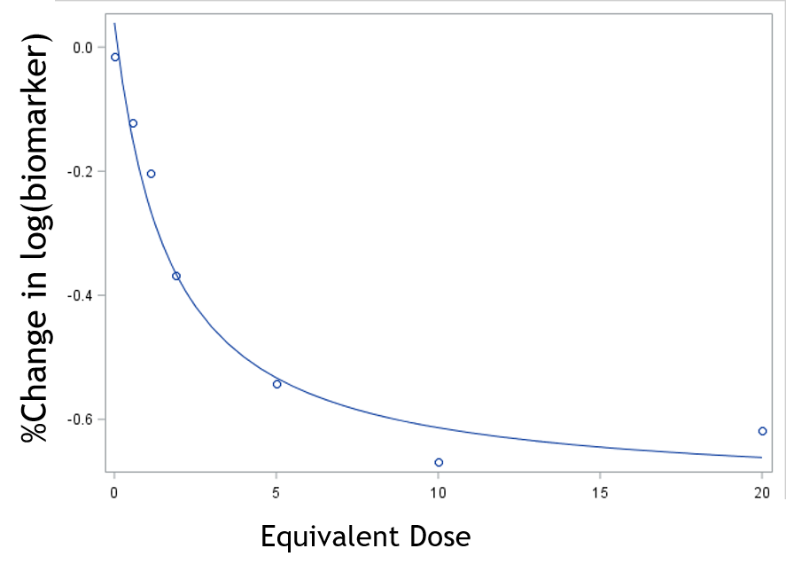
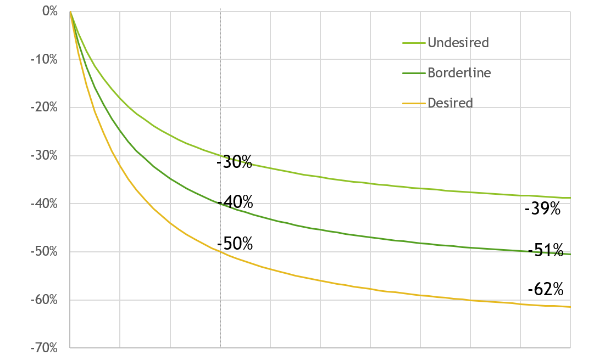

[Github](https://github.com/nicksun1) 
<html>
<head>
	<meta name="viewport" content="width=device-width, initial-scale=1">

</head>
<body>

        

            
        
  
    
fine location, GPS, coarse location

    
0 mins ago

    

	

	
	
	

	
Hi my name is Nicholas Sun currently working at Eli Lilly and Company, I am a statistician and data scientist with extensive experience performing analysis on massive, complex datasets. Interested in development of interpretable and robust tools backed by superior quantitative operating characteristics. My areas of expertise include statistical methodology development, large-scale simulation studies, predictive modeling, development of visualization tools. Phase 1, 2, and 3 Clinical trials and biomarker studies.

<html>
<head>

</head>
<body>

Comparison of Kaplan Meier curves under two different analysis methods

	

Analysis models for desired endpoints and simulation analysis.

  

    
  

  

    
  

 
[Github](https://github.com/nicksun1) 
[Learn more about me](./about/index.md)
</body>
</html>

 
